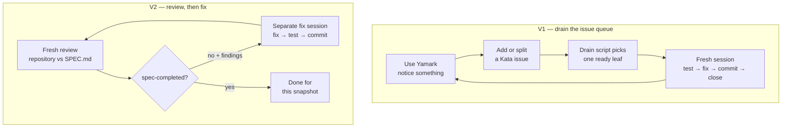

# Yamark: Building a Formatter with Long-Running Coding Agents

Like any curious person in this space, I have been experimenting with
LLM-assisted coding. In particular, I have been interested in
long-running agent workflows: repeated sessions that can work for hours,
or across several days, with little intervention between checkpoints.

One of those experiments produced something I now use every day.

[Yamark](https://github.com/t-kalinowski/yamark) is a very fast YAML and
Markdown formatter written in Rust. Among other things, it formats
Markdown embedded in YAML, Python, and R; recursively formats fenced
regions; and can align YAML flow mappings into readable tables. It also
ships with an extension for VS Code and Positron.

“Fast” is measurable here. In the checked-in v0.1.0 benchmark, Yamark
formatted a generated 500-file, 50 MB YAML corpus in 123 ms; the
next-fastest formatter in that run took 2.1 seconds. The
[benchmark page](https://t-kalinowski.github.io/yamark/benchmarks.html)
has the corpus construction, tool versions, and method.

I built Yamark twice. V1 evolved through a queue of small issues
discovered during daily use. It worked, but its architecture drifted
badly enough that I did not want to publish it. V2 began with a more
explicit architecture and used a repeated review-and-fix loop to work
through a large specification. That worked much better—but it also
demonstrated that matching a specification is not the same as building
the right product.

Yamark grew out of a mild frustration. I kept looking at LLM prompts
that first lived in YAML files and then in Python files. I was—and, in
Mitch Hedberg fashion, still am—working on a variation of Symphony in
which `WORKFLOW.md` becomes `WORKFLOW.yaml` or `WORKFLOW.py`. I might
open-source that when it is ready, but that is not what this post is
about.

## V1: build it, use it, drain the queue

V1 began with a substantial specification, not the issue queue. The
first commit, on May 6, added a 1,416-line `SPEC.md`. Forty-seven
minutes later, the initial implementation commit added 3,410 lines. The
first retained implementation prompt was simply: “Implement SPEC.md.
Spawn subagents where appropriate to do orthogonal chunks of work.” The
session then continued for hours with active direction from me about
architecture, tests, YAML scalars, and Markdown behavior.

Most of Yamark's code was written by coding agents. In the retained
sessions, agents wrote and committed the patches; I supplied
specifications, examples, architectural direction, feedback, and the
product decisions that came from using it.

Kata arrived two days later, after substantial development. Its drain
loop landed as the 83rd commit. A shell script asked Kata for one ready
issue, started a fresh agent session, and stopped if that session
failed. Its prompt allowed an oversized issue to be decomposed, but
required the agent to work on exactly one ready leaf issue. For code or
behavior changes, it required a failing public-API test before
implementation; all completed work had to be tested and committed before
the issue was closed. The Git history stayed linear on `main`.

Agents created or decomposed much of the queue. The first 32 issues were
loaded in about 70 minutes, several from an existing YAML support
document. Annoyances I encountered in daily use also fed the queue.

By May 18, V1 had reached 448 commits over twelve days. I enabled it
globally and it worked well enough that I wanted to share it. Then I
inspected its architecture.

V1 had hand-written YAML scanners and parsers, source-slice emission,
and a Markdown engine. The problem was architectural drift. It had
become a monolithic collection of scanners, parsers, semantic passes,
and formatting heuristics. By the end, `fast_yaml.rs` was 10,085 lines,
`fast_markdown.rs` was 5,207, and `formatter.rs` was 4,582. It parsed
the input, but it no longer had the simple, source-oriented shape I
wanted.

So I started V2.

## V2: review the whole specification, fix what remains

I used ChatGPT Pro to turn V1's behavior and tests into a specification,
then described the parser and emission architecture I wanted. The
retained local record begins with the resulting artifacts, so it does
not establish the exact preceding conversation or its duration.

The new repository was called `yamark2`. It was fresh, but not empty:
its first commit on May 18 already contained a 1,203-line `SPEC.md`, a
60-line `ARCHITECTURE.md`, Rust scaffolding, five case fixtures, and
their test harness. Its README explicitly called the code an
intentionally incomplete first-draft template.

I wanted it to parse once into a source-backed in-memory representation.
Unchanged regions would stay as spans into the original input, layout
decisions would happen as early as practical, and final emission would
be mostly mechanical. Wrapping and indentation make this trickier: a
scalar is not always one contiguous slice, and output still has to be
allocated. The point was to avoid copying unchanged input unless
formatting actually required it.

The first recorded prompt was: “Implement the SPEC.md here. Do not stop
until all the features described in SPEC.md are implemented.” Nineteen
minutes of agent work plus a later request to commit produced the first
large implementation patch.

Then I set up a different loop. A fresh review session compared the
entire repository with the entire specification and returned structured
findings. It was allowed to inspect code, run tests, and improve the
public-API test surface, but not to fix product code. If it found a gap,
a separate implementation session received those findings, fixed them,
tested the public behavior, and committed. Then review began again.

Once both loops existed, they looked roughly like this:

The retained sessions for this review-and-fix loop begin on May 21 EDT.
The driver did not enter Git until May 28, after it had already been
used. The loop ran in several bursts through May 30, with a six-day
pause in the middle; it was not one process running continuously for
nine days.

Across the sequence, reviews generally became longer while fixes became
shorter, although the individual timings were noisy.

The ten-pair rolling review median first exceeded the fix median in the
window covering pairs 25–34.

| Comparison                              | Review time | Fix time |
| --------------------------------------- | ----------: | -------: |
| First 10-pair block (1–10), median      |      4m 25s |  10m 33s |
| Last full 10-pair block (61–70), median |      8m 50s |   5m 15s |
| Pair before the terminal review         |      7m 11s |   2m 49s |

These are wall times. The terminal session remained open for 6h 52m,
although its own reported task duration was 55m 36s and the record
contains long gaps. I treat it as the endpoint of the sequence, not as
nearly seven hours of continuous review. It reported no remaining
product-code gaps against the then-current `SPEC.md`. The
[methodology appendix](blog-appendix.md) contains the pairing rules,
exclusions, complete timing table, and how I reconstructed the data.

The review-and-fix loop was only one phase of V2. Before it, I spent a
high-touch period refining the parser, source representation, and
emission model with agents. After it, the project moved into a different
benchmark-gated loop: try a performance change, measure it, keep or
revert it, and record the result. In fact, 468 of V2's 593 commits came
after the final review-loop fix.

## Then I changed the spec again

The review loop found and fixed differences between the code and the
spec. I was still changing the spec itself. Two earlier invocations had
already returned `spec-completed=yes`; later changes reopened the loop.
Each `yes` only meant that version of the code matched that version of
the spec.

The initial document described itself as “current behavior and inferred
product intent” and said it should be refined before being treated as
final. It was edited 18 times, growing from 1,203 to 1,355 lines, before
being deleted.

Some concrete examples:

- The earlier scalar policy said to preserve a quoted YAML string's
  spelling when that was safest. On May 29 I changed the desired policy
  to prefer an unquoted spelling whenever that was safe. The
  implementation followed.

- The terminal review reported `spec-completed=yes` on May 30. Less than
  five hours later, a new spec patch added layout intent that had been
  missing: unmatched `[` or `{` could request flow-style layout, while
  physical newlines inside flow collections could request expanded
  layout. The implementation followed 36 minutes later.

- On June 1 the spec was updated to include public `dump-ast` and
  `emit-ast` commands. The next day I decided they did not belong; the
  following patch removed the feature, deleting 3,083 lines. The
  implementation had matched the spec, but I changed my mind without
  updating the now-stale requirement. That section remained wrong until
  `SPEC.md` itself was deleted.

- The initial spec required wide Markdown tables to fall back to a
  compact form beyond a width threshold. After the spec was gone, I
  found that I preferred aligned tables even when they were wide, so I
  asked the agent to remove the fallback.

This was already happening in V1. Its first spec required an
unchanged-file cache; 24 minutes later I moved it to future work: “We
reparse every time.” It also started by preserving Markdown bodies
byte-for-byte and refusing to format fenced code. Both decisions changed
almost immediately. Duplicate YAML keys began as a validation error
until a Kata issue reminded me that Yamark was a formatter, not a schema
validator.

I do not think a longer planning session would have solved this. I had
to use the formatter before I could tell whether many of these decisions
were right. Watching it being implemented also exposed where the
architecture helped and where it got in the way.

This is not very different from the old agile observation that useful
feedback starts when working software exists. What felt different was
the speed. Once I liked the basic parser and source model, most of the
changes I discovered in daily use were small patches.

`SPEC.md` was deleted on June 6, and another 36 commits followed before
that repository's final commit on June 15. Since then, ordinary use has
produced small, concrete patches for image attributes, multiline raw
HTML, heading whitespace, spaces in wrapped YAML scalars, and multiline
brace attributes. Those are exactly the sorts of preferences and edge
cases I could not have specified convincingly in advance.

For these small follow-up patches in a solo project, I inspect the
changes, ask the agent to add and run public-API regression tests, and
commit directly to `main`. Daily use still found a regression: wrapping
a YAML scalar collapsed repeated spaces. It was local enough to fix with
focused tests and a patch rather than another architectural reset.

## Why Rust

Of course this is written in Rust. I knew Rust in the before times, so
it was comfortable enough. More importantly, I like it for agent-written
systems code. The compiler gives strong, fast, consistent feedback about
reality. An agent can be wrong about ownership, lifetimes, or
representation; `rustc` does not negotiate. In this project, a strict
compiler was an LLM's best friend.

## What I took from it

V1 kept moving as long as there was another issue in the queue. I did
not notice what the architecture had grown into until I stopped and
looked. V2 made differences between the code and the spec easier to
find, but I was still changing the spec.

The most obvious thing I would change next time is the record-keeping. I
had Git history and session logs, but I had not made the loop write a
simple event record for each run: the prompt, starting commit, start and
end times, status, findings, and resulting commit. Reconstructing those
facts afterward worked, but it took a lot of digging, and some timings
are still ambiguous.

I kept changing my mind as I used Yamark. Sometimes the code matched the
spec and I still did not like what it did.

Playing around with LLM-assisted workflows is actually a lot of fun. It
feels like a brand-new technology was just discovered and no one really
knows how to use it yet. It definitely feels a little like playing with
gasoline as a child: certainly dangerous, but also full of awe and joy
at being this close to raw power and novelty. I assume the
internal-combustion-engine equivalent comes later. For now, it smells a
little and is probably bad to breathe for too long. The analogy has more
mileage than I first thought.

If you are experimenting with long-running agent workflows that stretch
across hours or days—especially separate review and fix sessions, or
better ways to record what happened—I would like to compare notes.
