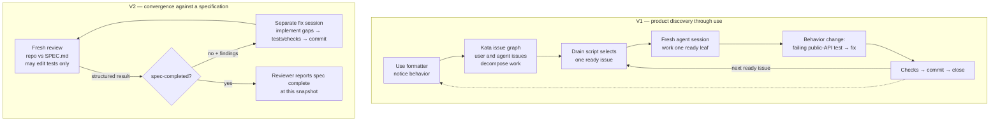
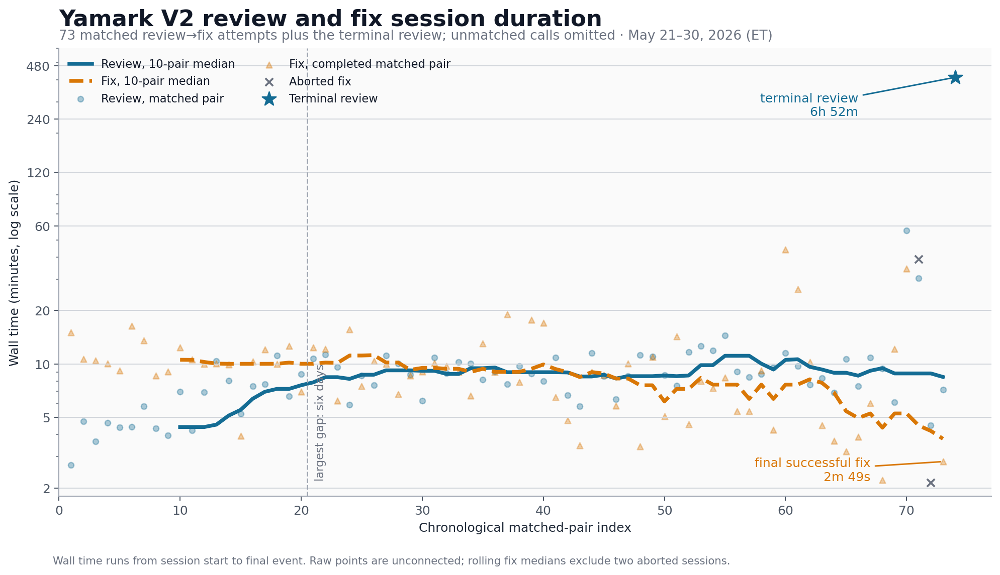

# Building Yamark Twice: What Long-Running Coding Agents Got Right and Wrong

I built Yamark twice with two different long-running coding-agent
workflows. They ran through repeated unattended sessions over hours or
days. My job was to design the process, choose the architecture and
product behavior, specify test expectations, evaluate the results, and
change course when use showed that the specification was wrong.

> V1 used a continuously replenished issue queue and produced useful
> software quickly, but accumulated architectural drift. V2 started from
> an explicit architecture and repeatedly separated whole-repository
> review from implementation. That process converged well, but the
> specification itself still had to evolve through use.

[Yamark](https://github.com/t-kalinowski/yamark) is a fast Rust
formatter for YAML and Markdown. It handles front matter; explicitly
marked Markdown in YAML, Python, and R; `#|` YAML comment blocks; YAML
and recursively nested Markdown fences; external formatters for other
fenced languages; directive-driven table alignment; and a VS Code and
Positron extension. The difficult parts were preserving syntax,
comments, and unsupported regions while normalizing layout, dispatching
embedded languages, and keeping the implementation source-oriented
rather than accumulating special cases.

In the checked-in v0.1.0 benchmarks on an Apple M4 Max, Yamark formatted
a generated 4 MB Markdown document in 115 ms, versus 338 ms for the next
tool in that run. It formatted a generated 500-file, 50 MB YAML corpus
in 123 ms, versus 2.1 seconds for the next tool. These are generated
corpora, not universal performance claims; the
[benchmark page](https://t-kalinowski.github.io/yamark/benchmarks.html)
records the construction, versions, and method.

Yamark grew out of a mild frustration. I kept looking at LLM prompts
that first lived in YAML files and then in Python files. I was—and, in
Mitch Hedberg fashion, still am—working on a variation of Symphony in
which `WORKFLOW.md` becomes `WORKFLOW.yaml` or `WORKFLOW.py`.

My role was workflow and architecture design, specifications, test
expectations, product decisions, evaluation, and correction. Retained
sessions establish that division more clearly than Git metadata, which
records the commits under my identity. This is a case study in
agent-system design and human judgment.

<!-- Before publication: add a 30–60 second representative formatting demo. -->

The two workflows had different feedback loops:

V1 fed product-use feedback into a leaf-work queue. V2 alternated
restricted review and fix contexts. A V2 “yes” was a report about one
repository snapshot and one version of the contract; it did not mean
product discovery was over.

## V1: product discovery and architectural drift

I remembered V1 as beginning with a basic prompt followed by a growing
issue queue. The history says otherwise: the first commit added a
1,416-line `SPEC.md`, and the initial implementation followed 47 minutes
later. The retained session then shows hours of direction from me on
architecture, tests, YAML scalars, and Markdown behavior.

The drain loop landed two days later as the 83rd commit. It asked Kata
for one ready issue and launched a fresh agent session. Agents could
decompose oversized issues, but had to complete exactly one ready leaf:
add a failing public-API test for behavior changes, implement, test,
commit, and close. History stayed linear on `main`.

Daily-use feedback supplied new product issues; agents also expanded
larger documents and issues into dependency-linked leaf work.

V1 reached 448 commits over twelve days. I enabled it globally and used
it; when I considered sharing it, I audited its architecture as a whole.

Here my memory was unfair. V1 was not “regexes on top of regexes,” and
it was not “not a parser in any sense.” It did not even depend on Rust's
regex crate. It had hand-written YAML scanners and parsers, a semantic
graph, source-slice emission, and a Markdown engine.

The problem was architectural drift. V1 had become a monolithic
collection of scanners, parsers, semantic passes, and formatting
heuristics. By the end, `fast_yaml.rs` was 10,085 lines,
`fast_markdown.rs` was 5,207, and `formatter.rs` was 4,582. The problem
was not the absence of a parser. It was that the parser and formatter no
longer had the simple, source-oriented shape I wanted.

So I started V2.

## V2: separate review from implementation

I remember asking ChatGPT Pro to turn V1's tests and behavior into a
specification, then describing the architecture in a longer session.
Local history cannot verify the chat surface or duration, but it
preserves the resulting artifacts.

The new repository was called `yamark2`. It was fresh, but not empty:
its first commit on May 18 already contained a 1,203-line `SPEC.md`, a
60-line `ARCHITECTURE.md`, Rust scaffolding, five case fixtures, and
their test harness. Its README called the code an intentionally
incomplete first-draft template.

The architecture was the important part. I wanted parsing to produce a
source-backed in-memory model, with unchanged regions represented as
spans into the original buffer. Layout and emission decisions should be
made early enough that final emission is mostly mechanical. That design
minimizes copying; it does not literally eliminate output allocations.

The first recorded prompt was: “Implement the SPEC.md here. Do not stop
until all the features described in SPEC.md are implemented.” Nineteen
minutes of agent work plus a later request to commit produced the first
large implementation patch.

Then I set up a different loop. A review agent compared the entire
repository with the entire specification and returned structured
findings. It could inspect code, run tests, and improve public-API
tests, but could not fix product code. If it found a gap, a separate
implementation agent received the findings, fixed them, tested the
public behavior, and committed. Then review began again.

Retained sessions show the loop running in several bursts from May 21
through May 30, with a six-day pause. The driver was committed on May
28, after it had already been used.

The timing is the part I remembered most clearly—and too neatly. Early
reviews were short and fixes were long. Later reviews were generally
longer than early reviews, while fixes were generally shorter. The raw
series is noisy; two smooth lines did not steadily cross.

| Comparison                              | Review time | Fix time |
| --------------------------------------- | ----------: | -------: |
| First 10-pair block (1–10), median      |      4m 25s |  10m 33s |
| Last full 10-pair block (61–70), median |      8m 50s |   5m 15s |
| Last completed pair                     |      7m 11s |   2m 49s |
| Terminal review                         |  6h 52m 20s |        — |

Durations in the chart are wall time. The terminal review remained open
for 6h 52m, while its reported task duration was 55m 36s. The last
successful fix took 2m 49s, and the review that followed reported no
remaining product-code gaps. My recollection of “over two hours”
understated the wall time. The [methodology appendix](blog-appendix.md)
records the matching rules, exclusions, full timing table, and
provenance boundaries.

One operational weakness became visible only during this reconstruction:
I had session logs, but I had not designed a first-class event stream
for the experiment. Next time I would record the prompt hash, repository
state, start and end times, exit status, structured findings, and
resulting commit for every run. Retrofitting those facts from session
files worked, but introduced avoidable ambiguity.

## Convergence did not finish product discovery

The loop established alignment with a repository snapshot; it did not
establish that the snapshot described the right product. Two earlier
invocations had already returned `spec-completed=yes`, and later changes
reopened the loop. The specification called itself inferred intent, was
edited 18 times, and grew from 1,203 to 1,355 lines before deletion. The
code and specification were teaching each other.

Some concrete examples:

- The initial scalar policy favored preserving a quoted YAML string's
  spelling when it was safe. On May 29 I changed the specification to
  prefer an unquoted spelling whenever that was safe, then changed the
  formatter to match.

- The terminal review declared the spec complete on May 30. Less than
  five hours later, a new spec patch added missing layout intent:
  unmatched `[` or `{` could request flow-style layout, while physical
  newlines inside flow collections could request expanded layout. The
  implementation followed 36 minutes later.

- On June 1 the specification added public `dump-ast` and `emit-ast`
  commands. The next day I decided they did not belong and deleted 3,083
  lines. The implementation had matched the requirement; the product
  judgment changed. The now-stale requirement remained until `SPEC.md`
  itself was deleted.

- The initial specification required wide Markdown tables to fall back
  to a compact form beyond a width threshold. After the specification
  was gone, I found that I preferred aligned tables even when they were
  wide and removed the fallback.

I do not think a longer planning session would have solved this. Using
working software changed what I wanted. Once V2 had a coherent parser,
source model, and public-API test surface, those discoveries became
small patches instead of architectural emergencies.

The V2 `main` branch contains 593 commits. `SPEC.md` was deleted on June
6, and another 36 commits followed before that repository's final commit
on June 15. The public repository was then created with a fresh root
containing the then-current tree. Ordinary use has since produced small,
concrete fixes for image attributes, multiline raw HTML, heading
whitespace, spaces in wrapped YAML scalars, and multiline brace
attributes. I inspect those patches and ask the agent to add and run
public-API regression tests, but I still commit directly to `main`;
there is no conventional pull-request or second-reviewer process for
these tweaks.

## Why Rust

Of course this is written in Rust. I knew Rust in the before times, so
it was comfortable enough. More importantly, I like it for agent-written
systems code. The compiler gives strong, fast, consistent feedback about
reality. An agent can be wrong about ownership, lifetimes, or
representation; `rustc` does not negotiate. In this workflow, a strict
compiler was an agent's best friend.

## Evidence and methodology

The [methodology appendix](blog-appendix.md) contains the repository
reconstruction, Kata issue-store statistics, complete timing table,
session-selection rules, specification-change summary, commit anchors,
and publication boundaries. A separate reviewed evidence repository will
eventually make the faithful V1 and V2 histories, exact prompts, driver
scripts, sanitized timing data, plotting code, and commit-to-event index
independently inspectable. Raw session bodies will remain private.

<!--
Before publication: replace the future-tense evidence paragraph with a link
to the reviewed repository.
-->

## What I would reuse—and change

V1 taught me that a queue can keep an agent productive while
architectural drift remains difficult to see. V2 taught me that a fresh
review context, prevented from editing product code, can drive
whole-repository convergence—but only against the contract it is given.

I would reuse one-ready-task execution, reviewer/implementer separation,
public-API regression tests, task-scoped commits, and structured review
findings. I would add first-class process telemetry, provenance capture
from the first run, predeclared experiment checkpoints, explicit rules
for restarting after a successful review, and periodic human review of
the specification itself.

The human job did not disappear. It moved up a level: choose the
architecture, decide product semantics, notice when use disproves the
contract, and recognize when a clean implementation is solving the wrong
problem.

Working with long-running coding agents still feels like working with a
newly discovered fuel: powerful, hazardous, and not yet surrounded by
mature machinery. The production systems may come. For now, much of the
work is discovering which processes reliably turn that raw capability
into maintainable software.

I am interested in comparing this workflow with other long-running agent
systems, particularly approaches to review independence, convergence,
provenance, and sandboxed execution.
